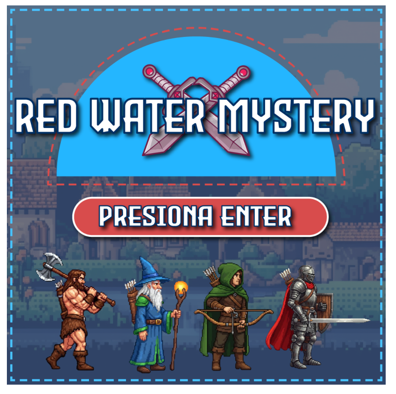
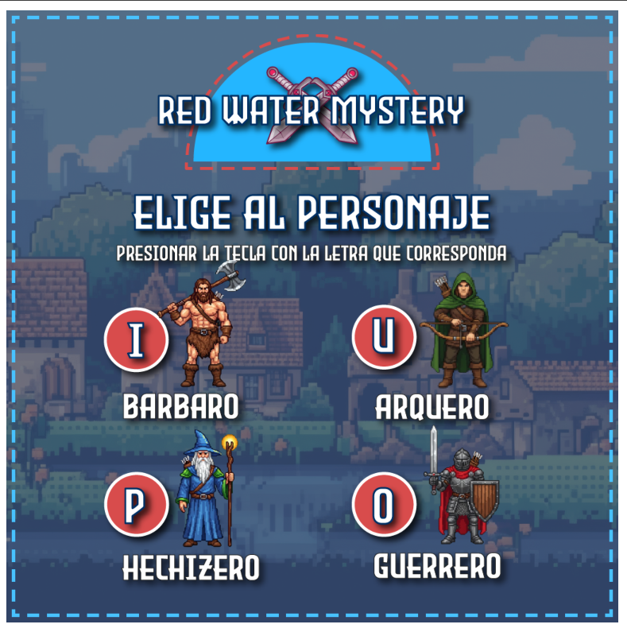
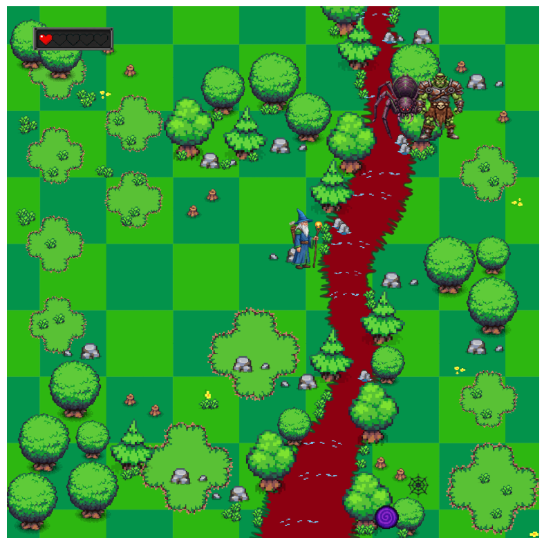
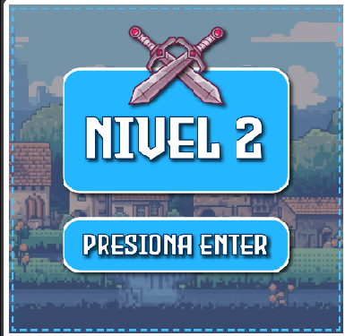
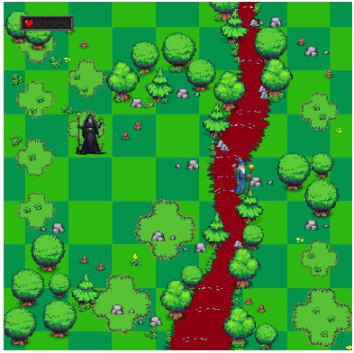
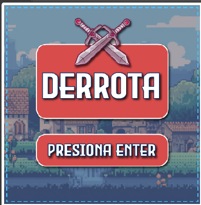
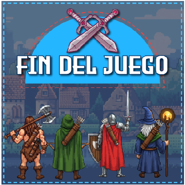

# ⚔️🧟 Red Water Mystery 🕷️⚔️

## 🧙‍♂️ Equipo de desarrollo

* Augusto Morán
* Cristian Signorini
* Analía Rossotti
* Daiana Díaz
* Diego Goso
* Darío Robles
* Florencia Saharrea

## PRESENTACION EN POWERPOINT:

https://docs.google.com/presentation/d/1aUXR1Wd1IOLSuGrzuSM0re2AAUJssk1T/edit?usp=sharing&ouid=114910798792590590614&rtpof=true&sd=true

## 📸 Capturas

*Pantalla principal del juego.*

*Menú de selección de personajes.*

*El jugador en el Nivel 1.*

*Pantalla de transición al siguiente nivel.*

*Escena del nivel final.*

*Créditos del equipo de desarrollo.*

*Pantalla de "Game Over" o derrota.*

*Pantalla de victoria al completar el juego.*

## ⚔️ Reglas de Juego / Instrucciones

### 🎯 Objetivo
Conviértete en el héroe de estas tierras sobreviviendo a las hordas de criaturas. Tu objetivo final es **derrotar al temible Jefe** para restaurar la paz y consagrar tu honor.

### 🗺️ Flujo del Juego
El camino a la victoria se divide en varias etapas:

**Pantalla de Inicio:** El juego te da la bienvenida.
**Selección de Héroe:** Elige tu estilo de combate, seleccionando a uno de los cuatro héroes:
    * 🪓 Guerrero
    * 🏹 Arquero
    * 🛡️ Bárbaro
    * 🪄 Mago
**Nivel 1 - La Horda:** Tu aventura comienza. Deberás sobrevivir en un mapa infestado de **Arañas y Orcos** que te atacarán sin tregua. ¡Elimínalos a todos!
**Nivel 2 - El Jefe:** Una vez que hayas limpiado el mapa de enemigos menores, serás transportado al desafío final. Aquí te enfrentarás al **Jefe** y sus ataques devastadores.
**Victoria o Derrota:** Si logras vencer al Jefe, habrás ganado el juego. Si tu vida llega a cero en cualquier momento, la derrota manchará tu honor y la partida terminará.

### 🎮 Controles
* **Movimientos (w,a,s,d):** Mover a tu personaje por el mapa.
* **Tecla J:** Lanzar el hechizo especial de tu héroe.

### 💥Mecánicas Principales
* **Sistema de Vida:** Comienzas tu aventura con 5 puntos de vida.
* **Combate:** Al presionar **[J]**, tu personaje lanza un hechizo en la última dirección a la que se movió. Los enemigos también se mueven por el mapa y te atacarán con sus propios hechizos.
* **Daño:**
    * Si un hechizo enemigo te golpea, pierdes 1 punto de vida.
    * Si tu hechizo impacta a un enemigo, este perderá vida.
* **Game Over:** Si tu vida llega a 0, la partida termina. El juego mostrará la pantalla de "Game Over" y se reiniciará tras unos segundos.
* **Condición de Victoria:** Para ganar el juego, debes **derrotar al Jefe** del Nivel 2.

## ℹ️ Otros

* **Curso/Facultad:** Programación Orientada a Objetos I - UNAHUR (Universidad Nacional de Hulingham)
* **Versión de wollok:** Wollok 4.0.0
* **Visibilidad:**
    * Una vez terminado, no tenemos problemas en que el repositorio sea público.
